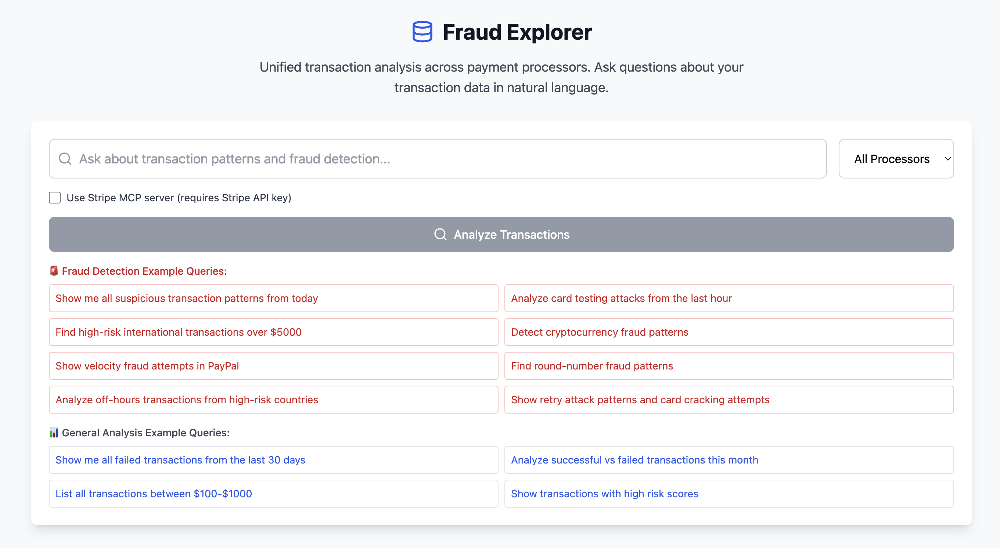

# Fraud Explorer MVP

This is a demo of a fraud detection and transaction analysis platform that enables risk teams to query and analyze transaction data across multiple payment processors using natural language queries powered by Claude AI. Features advanced fraud pattern detection algorithms and comprehensive risk analysis.

All data is mocked, but you have the ability to test using the Stripe MCP connection as an example of using real data. ß 

## Screenshot



## Features

### Core Capabilities
- **Natural Language Queries**: Ask questions about transaction data in plain English powered by Claude 3.5 Sonnet
- **Advanced Fraud Detection**: 8 sophisticated fraud pattern detection algorithms analyzing transactions in real-time
- **Multi-Processor Support**: Unified view across Stripe and PayPal (with mock data for demo)
- **Interactive Visualizations**: Sortable transaction tables with fraud pattern cards showing risk levels
- **100+ Mock Transactions**: Diverse dataset with realistic fraud patterns for demonstration

### Fraud Detection Algorithms
1. **Card Testing Detection** - Identifies card validation attacks (multiple small failed transactions)
2. **Velocity Fraud** - Detects high-frequency transaction patterns
3. **High-Risk Geography** - Flags transactions from known fraud hotspots
4. **Round Number Fraud** - Identifies suspiciously round payment amounts
5. **Off-Hours Transactions** - Detects unusual timing patterns from high-risk locations
6. **Retry Attacks** - Identifies card cracking attempts (failed attempts followed by success)
7. **High-Value International** - Flags large cross-border transactions from uncommon countries
8. **Cryptocurrency Fraud** - Detects potential money laundering through crypto exchanges

## Quick Start

### Prerequisites

- Node.js 18+ 
- An Anthropic API key (for Claude)
- A Stripe account with API access (for transaction data)

### Installation

1. **Clone and install dependencies**:
   ```bash
   npm install
   ```

2. **Set up environment variables**:
   ```bash
   cp .env.example .env.local
   ```
   
   Edit `.env.local` and add your API keys:
   ```
   ANT_API_KEY=your_claude_api_key_here
   STRIPE_SECRET_KEY=your_stripe_secret_key_here
   ```

3. **Start the development server**:
   ```bash
   npm run dev
   ```

4. **Open your browser** and navigate to `http://localhost:3000`

## Usage Examples

### Fraud Detection Queries
Try these natural language queries to see fraud detection in action:

**Critical Fraud Patterns:**
- "Show me all suspicious transaction patterns from today"
- "Analyze card testing attacks from the last hour"
- "Detect cryptocurrency fraud patterns"
- "Show velocity fraud attempts in PayPal"
- "Find retry attack patterns and card cracking attempts"

**Risk Analysis:**
- "Find high-risk international transactions over $5000"
- "Show round-number fraud patterns"
- "Analyze off-hours transactions from high-risk countries"

**General Transaction Analysis:**
- "Show me all failed transactions from the last 30 days"
- "Analyze successful vs failed transactions this month"
- "List all transactions between $100-$1000"
- "Show transactions with high risk scores"

## Architecture

### Tech Stack
- **Frontend**: Next.js 14 with React, TypeScript, and Tailwind CSS
- **AI/ML**: Claude 3.5 Sonnet via Anthropic SDK
- **Data Sources**: Stripe MCP + PayPal Mock Client
- **Fraud Detection**: Custom pattern analysis algorithms
- **UI Components**: Lucide React for icons

### Key Components

1. **Query Interface** (`src/components/QueryInterface.tsx`)
   - Natural language input with processor selection (Stripe, PayPal, or All)
   - Real-time loading states and error handling

2. **Fraud Pattern Visualization** (`src/components/FraudPatterns.tsx`)
   - Interactive fraud alert cards with risk levels (Critical, High, Medium, Low)
   - Detailed indicators and actionable recommendations
   - Click-to-filter affected transactions

3. **Data Table** (`src/components/DataTable.tsx`)
   - Sortable columns for all transaction fields
   - Status indicators with color coding
   - Responsive design with proper data formatting

4. **Fraud Detector** (`src/lib/fraud-detector.ts`)
   - 8 independent fraud detection algorithms
   - Risk scoring and pattern grouping
   - Transaction clustering for related suspicious activities

5. **Claude Integration** (`src/lib/claude.ts`)
   - Natural language query processing
   - Intent extraction and filter generation
   - Context-aware analysis

6. **Payment Processor Clients**
   - **Stripe MCP** (`src/lib/stripe-mcp.ts`): MCP-based Stripe integration with mock data
   - **PayPal Mock** (`src/lib/paypal-mock.ts`): 100+ diverse transactions with realistic fraud patterns

## Environment Setup

### Getting API Keys

1. **Anthropic API Key**:
   - Sign up at https://console.anthropic.com/
   - Navigate to API keys section
   - Create a new API key and copy it

2. **Stripe API Key**:
   - Log in to your Stripe Dashboard
   - Go to Developers > API keys
   - Copy your Secret key (starts with `sk_`)

### Production Deployment

For production deployment:

1. **Environment Variables**: Set up the same environment variables in your hosting platform
2. **Stripe MCP**: Replace the mock client with actual Stripe MCP server integration
3. **Security**: Implement proper authentication and authorization
4. **Rate Limiting**: Add rate limiting for API endpoints
5. **Error Monitoring**: Set up error tracking and monitoring

## Development

### Project Structure
```
src/
├── app/              # Next.js app directory
│   ├── api/          # API routes
│   └── globals.css   # Global styles
├── components/       # React components
├── lib/             # Utility libraries
└── types/           # TypeScript type definitions
```

### Adding New Features

1. **New Query Types**: Extend the query parsing logic in `src/app/api/query/route.ts`
2. **Additional Data Sources**: Create new MCP clients in `src/lib/`
3. **Enhanced UI**: Add new components in `src/components/`

## Troubleshooting

### Common Issues

1. **API Key Errors**: Ensure your environment variables are properly set
2. **Build Errors**: Check that all dependencies are installed with `npm install`
3. **TypeScript Errors**: Run `npm run build` to check for type issues

### Getting Help

For issues with:
- **Claude AI**: Check Anthropic's documentation
- **Stripe MCP**: Refer to Stripe's MCP documentation
- **Next.js**: Consult Next.js documentation

## Mock Data

The application includes 100+ carefully crafted mock transactions demonstrating:
- **Geographic Diversity**: US, Canada, Europe, and high-risk countries (Nigeria, Russia, Pakistan)
- **Currency Variety**: USD, EUR, GBP, CAD
- **Realistic Amounts**: From $1.25 coffee purchases to $20K business transactions
- **Authentic Fraud Patterns**: Based on real-world fraud scenarios including:
  - 15 rapid small transactions (card testing)
  - High-value international transfers ($8.5K EUR, $12K GBP)
  - Round number patterns ($5K, $10K, $20K)
  - Off-hours activity (3 AM transactions from high-risk countries)
  - Retry attacks (8 failures followed by 1 success)
  - Cryptocurrency exchanges ($5K-$10K)

## Next Steps

This MVP demonstrates comprehensive fraud detection capabilities. For production:

1. **Real Data Integration**:
   - Connect to actual Stripe MCP server
   - Add real PayPal API integration
   - Support additional processors (Square, Adyen, etc.)

2. **Enhanced Fraud Detection**:
   - Machine learning models for anomaly detection
   - Historical pattern analysis and trend detection
   - Configurable risk thresholds per merchant

3. **Production Features**:
   - User authentication and role-based access control
   - Database persistence for transaction and analysis history
   - Real-time monitoring with WebSocket updates
   - Export features (CSV, PDF reports)
   - Dashboard views with analytics
   - Alert notifications (email, Slack, PagerDuty)

4. **Compliance & Security**:
   - PCI DSS compliance measures
   - Audit logging for all queries and actions
   - Data encryption at rest and in transit
   - Configurable data retention policies

## License

This project is for demonstration purposes. Ensure compliance with all relevant APIs' terms of service.